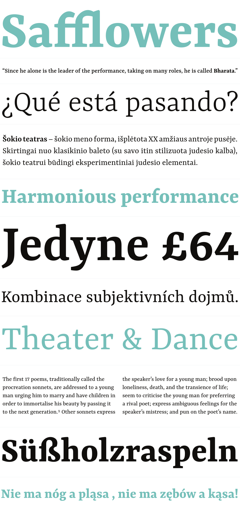
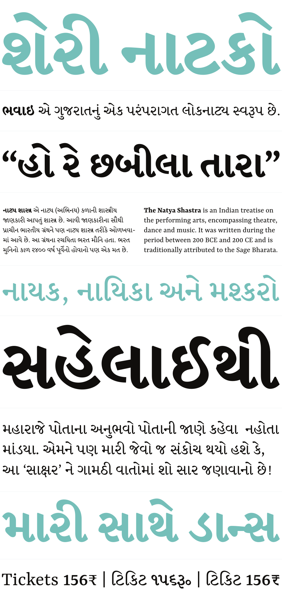

{:.full}

# Yrsa & Rasa

**Yrsa** and **Rasa** are open-source type families published by [Rosetta](https://rosettatype.com) with generous financial support from Google. The fonts support over 92 languages in Latin script and 2 languages in Gujarati script (Gujarati and Kachchi). The family currently has 5 weights. The design and production are done in-house, by [Anna Giedryś](http://ancymonic.com) ([@ancymonic](http://github.com/ancymonic)) and [David Březina](http://davi.cz) ([@MrBrezina](http://github.com/MrBrezina)).

Yrsa is the name of the Latin-only type family. Rasa is the name of the Gujarati type family. Both type families are intended for continuous reading on the web (longer articles in online news, magazines, blogs). In Yrsa, a special consideration was given to Central and East European languages and proper shaping of their accents. Rasa supports a wide array of basic and compound syllables used in Gujarati. In terms of glyphs included Rasa is a superset of Yrsa, it includes the complete Latin.

What makes Yrsa & Rasa project different is the design approach. It is a deliberate experiment in remixing existing typefaces to produce a new one. The Latin part is based on [Merriweather](http://sorkintype.com/fonts.html#mw) by Eben Sorkin. The Gujarati is based on David Březina’s [Skolar Gujarati](https://www.rosettatype.com/Skolar#gujarati).

The project has been documented in several articles (see links at the bottom).

[Yrsa & Rasa GitHub repo](http://github.com/rosettatype/yrsa-rasa){:.secondary}  [Download the Yrsa fonts](https://github.com/rosettatype/yrsa-rasa/releases/download/v1.001/Yrsa-fonts-v1.001.zips){:.primary}  [Download the Rasa fonts](https://github.com/rosettatype/yrsa-rasa/releases/download/v1.001/Rasa-fonts-v1.001.zips){:.primary}

{:.full}

{:.full}

