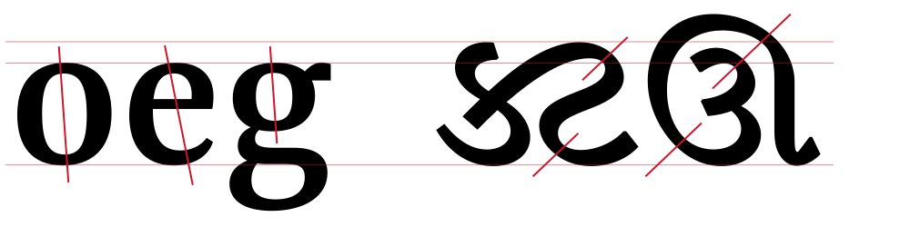
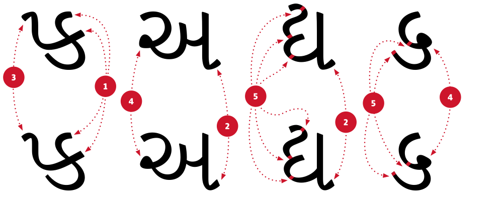

This is the second post in a series about our open-source project Yrsa/Rasa – a contemporary typeface for continuous text setting in Latin and Gujarati, for both web and print designed by Anna Giedryś and me. The project is subsidised by Google and you can follow the ongoing development on [GitHub](http://rosettatype.github.io). You can also get in touch via [email](mailto:ask@rosettatype.com) if you want to give the finished Latin part a test drive before all scripts are officially released in February.

Let me elaborate on the naming first. Yrsa is used for Latin and any other European script, Rasa is for Gujarati and any other Indic script. The original reason for this change was a technical requirement of the Google Fonts system, but it is also quite nice that the Indic fonts get an Indic name while the Latin fonts keep the European moniker.

In this article, I would like to write a little bit about the challenges of peaceful coexistence between Latin and Gujarati in one typographic environment. What does it mean and can type designers control this kind of coexistence at all? I think not, certainly not to the full extent. But they can prepare tools, i.e., multi-script fonts, which would be convenient for typographers: easy-to-use fonts with predictable and practical defaults. In this regard, an *equal importance* of each script in multi-script fonts is of essence. This allows typographers to control the relationship between the scripts well. They might, of course, eventually decide to emphasize one of the scripts depending on the content and genre they are designing for.

When it comes to a harmonization strategy, there is a scale that ranges from no changes at all to radical uniformity. “Harmony“, “uniformity”, and “matchmaking” are some of the words people would use to refer to various points on this spectrum. Rosetta is subscribed to the concept of *loose harmonization* which crudely put means: make scripts look equally important, harmonize what you can, and don’t touch the rest. Of course the tricky bit is knowing what you can or cannot change. It takes experience with each script to recognize the areas that can share a similar treatment. It depends on a particular genre of documents one is designing for. To make it even more complex, there are also cultural differences to consider. Different shapes have different connotations in different environments. What looks modern in Latin, may look dated in Gujarati etc. The only recommendation for navigating through this minefield is intensive exposure to corresponding scripts and study of their history and technological developments. Alternatively, a knowledgeable consultant might be of help.

As I mentioned in the [previous post](introducing-yrsa/) the Gujarati is based closely on Skolar Gujarati, so there is no point in explaining how we draw each and every character. They were drafted already when we started. We *only* had to make sure the Latin and Gujarati are equally important typographically and that both have a natural style that resonates well with the other.

Specifically, we had to make sure the relative scaling and weights of each script was right. Aligning the Gujarati to the proportional grid of the Latin or vice versa would clearly produce unequal sizing (see the figure above). One script appearing smaller than the other would be an issue of course. Therefore, their relative sizes have been based on comfortable reading experience and typical size expectations of each script.

Similarly for the weight, an overly bold typeface will look more important. Once the size was set, Anna corrected the weight of the Gujarati to match with the Latin (see the figure above). At the same time, in order to bring the two styles closer together, she increased the contrast between thick and thin bits in the Gujarati (see number 5 in the last figure). It is important to note that the stress in Indic scripts goes in the opposite direction to that of Latin (see the figure below) and increasing contrast or boldening has to respect this.

Yrsa Latin is a transitional design, so some letters have oblique and some have vertical stress. This is not very common in Gujarati which usually follows a fairly consistent oblique angle. Transitional contrast would be alien to this script, so we decided to stick with a solution typical to Gujarati. In the end, we are designing a typeface for continuous reading, not an experimental display type family.

After the important bits were out of the way, we could play with stylistic details. These might not matter much in small sizes on screen, but we wanted the fonts to look great even in print and in headlines.  Here are some of the smaller stylistic changes (see the figure above): the softer endings of Skolar were removed (1), the typical Gujarati foot (aka flick or vanaak) has changed (2) as well as the short in-strokes in ‘pa’ and ‘ma’, both are simpler and relate better to the other endings (3), and the knots are more triangular if ever so slightly (4).

To conclude, one needs to know very well how to shape a script to make it resonate with another. When done wrong, it creates something that looks harmonised to a Latin-script designer, but comes across as a clunky pastiche to Gujarati readers (and vice versa!). Let’s hope, we are on the right track.