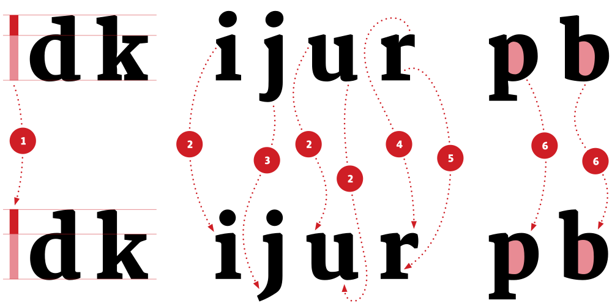

# Introducing Yrsa

Yrsa is an open-source/libre project we have just started with generous financial support from Google Fonts. The typeface is going to support some 45+2 languages in Latin and Gujarati scripts and will be freely available from the Google Fonts directory, once it is ready. Design and production are done in-house at [Rosetta](http://rosettatype.com), by [Anna Giedryś](http://ancymonic.com) ([@ancymonic](http://github.com/ancymonic)) and me ([David Březina](http://davi.cz) – [@MrBrezina](http://github.com/MrBrezina)).

What makes Yrsa different is the design approach. It is a deliberate experiment in remixing existing typefaces to produce a new one. As such, we find it fascinating and… honest.

Let me explain what I mean by that. It is not uncommon in our profession to use previous typefaces as a starting point for something new. Stanley Morison took Monotype’s Plantin as the basis for Times New Roman (1986), Gerard Unger speaks openly of reusing drawings of his former designs, and I suspect there are many others. And it does make sense. Type design is a time consuming activity and there is no need to reinvent the wheel over and over again. However, using someone else’s outlines is not a concept that appeals to everyone. Besides legal issues, personal integrity and the strive for originality seem to be the most common concerns. But maybe it is not all black and white.

Gerrit Noordzij (1991) points out that “writing is a convention. […] unconventional writing is no writing at all.” This also applies to fonts. In order to decode a message set in a particular typeface, the letters need to resemble the ones we already know, either from handwriting or from existing typefaces. In this sense every typeface is a revival. It cannot not be. Every type designer knows that, most have probably encountered it, yet very few seem to acknowledge that in their work. Would it affect anyone’s personal integrity if the sources of inspiration were more discernible? Is it possible to do that at all? Would such a typeface be perceived as less original by the customers? Would it reduce the sales? I do not know. What I know is that the design process is too often portrayed as if it was plucked out of thin air. It was not.

Just to be clear, this is not a manifesto for plagiarism. A truly creative person will always find their own voice, sufficiently distanced from everyone else's. It is a matter of common decency to not benefit from other people's work without their consent. Regardless if this is permitted by law or if it is an improvement of the corresponding work.

In his excellent article, Jan Michl elaborates on this issue and suggests that we should try to [see design as redesign](http://janmichl.com/eng.redesign.html). I could not agree more. Yrsa is an opportunity to play with that idea in practise. It is a redesign of contemporary typefaces.

The Latin part of Yrsa will be based on [Merriweather](http://sorkintype.com/fonts.html#mw) by Eben Sorkin. It has been released under [SIL Open Font License](http://scripts.sil.org/cms/scripts/page.php?site_id=nrsi&id=OFL) which allows us to modify and release the design under a new name. The Gujarati will be based on my own [Skolar Gujarati](https://www.rosettatype.com/Skolar#gujarati).

{:.full}

The illustration shows Merriweather (top) compared to an initial sketch of Yrsa (bottom). The ascenders will be taller (1), the serifs will be bracketed (2 & 5), the head serifs will be less dominant while the outstroke in the ‘u’ (and consequently in the ‘a’) will become more prominent (2). We will also make the terminal in the ‘r’ a bit stronger (4) and simplify the ‘j’ (3). And finally, the counters will be more squarish with a bit ‘less dynamic’ modulation (6).

Our hope is that we will not step on anyone’s toes, i.e. into the uncomfortably immediate vicinity of other designs, while redesigning from Merriweather. We are aware of typefaces with a similar spirit (e.g. Milo Serif or Guardian Egyptian) and are making sure we keep a respectful distance. This is less of a problem with Gujarati where the stylistic space is much less populated.

Wish us luck. That is it for now. You can find the project on [GitHub](https://github.com/rosettatype/yrsa-rasa) already.

We intend to write a little series to document the progress. In the next article, we will present the Gujarati sketches together with some considerations regarding the harmonization of both scripts.

— David Březina, 31 August 2015

## References

Michl, Jan. 2002. On Seeing Design as Redesign : An Exploration of a Neglected Problem in Design Education. [http://janmichl.com/eng.redesign.html](http://janmichl.com/eng.redesign.html).

Noordzij, Gerrit. 1991. “The Shape of the Stroke.” In Raster Imaging and Digital Typography II, edited by Jacques André and Robert A Morris, 34–37. Cambridge University Press.

Tracy, Walter. 1986. Letters of Credit : A View of Type Design. Boston: D.R. Godine.

