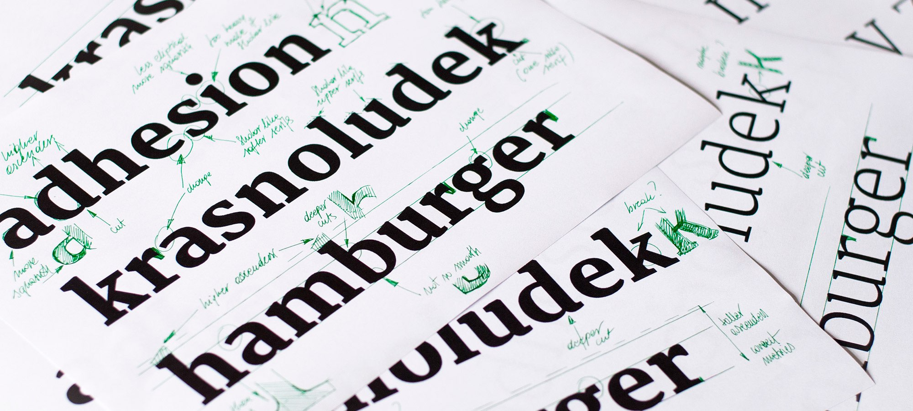

# Yrsa & Rasa released

Yrsa and Rasa are open-source type families published by [Rosetta](http://rosettatype.com) with generous financial support from Google. The fonts support over 92 languages in Latin script and 2 languages in Gujarati script. The family currently has 5 weights. They were designed and produced by Anna Giedryś and me and they are now released and ready for download.

I wrote two articles about the project development where we discussed what we [meant by remixing](introducing-yrsa/) and how we approached [harmonization of two different scripts](harmonizing-rasa-gujarati-and-yrsa-latin/) such as Latin and Gujarati. Today, as we release the fonts out into the wild I will explain what we learned from this six-month-long exercise.

But first, we need to clarify who did what. Anna was the main draughtswoman. I was merely a supervisor, occasional stern critic, main revisionist of the Gujarati, and a coder. Briefly put, if there is anything to like, it is Anna’s. If there is anything wrong, it is mine.

## Design as redesign

Is it useful to start from an existing design? We believed it would be faster to change Merriweather than draw a new design from scratch. And it was faster, but not as much as we expected. We wanted to change more than we had originally planned. As we worked, we found that the version of Merriweather we started from had some inconsistencies: stems with different thicknesses, serifs that were a bit different from each other in unexpected ways*, and some shapes that we simply would have done differently.

Some of these were deliberate design decisions to make the texture more lively. Others were differences of opinion. Some small, some large (we hereby disapprove of Merriweather’s sterling symbol). A lot of the corrections Anna felt needed to be done, were beyond what initially seemed like a straightforward restyling. In contrast, converting Skolar Gujarati to Rasa was much more effortless. Only the bold weight required more creativity, when harmonising with Yrsa’s contrast and weight (see our previous post for details). A matter of less different opinions?

## Design as testing

On the other hand, and on a more positive note, Anna got to design with real texts in no time. When starting from scratch, type designers typically have a handful of letters which cannot provide real-life testing environment. Even a–z is insufficient, as capitals and punctuation are missing. This setup makes going from the big picture of typography and layout to the micro-level of type design really tricky. One might easily miss the intended niche for their fonts. Imagine digging a tunnel from both sides of a hill, but without navigation. Fortunately, in our case we had a complete set of characters to test and proportions we were fairly happy with. This allowed us to make critical judgements about what works and what does not, and make informed design decisions.

In Gujarati that applies even more. Seeing the whole, large character set and how it is set up provides a comfortable safety hammock.

## Design as dialogue

It is enlightening to have a conversation among curves and forms with a fellow type designer and uncover their thoughts and misdemeanours in great detail. But it should be a dialogue, not just listening or parroting. There is a point where an opinion ought to be voiced and that can take some energy. We previously stated that every design is redesign, now we can safely say that with an opinion of one’s own, every redesign quickly turns into design.

## Design as service

Now, take the fonts and make something nice with them! Every font remains incomplete until someone uses it. We both hope you will like to use them.

Yrsa & Rasa are released under the Open Font Licence and free to use. They will soon be available in the Google Fonts directory and Adobe Typekit.

Their main purpose is continuous reading on the web (think Medium), British visual style (now with a decent looking sterling symbol), Gujarati visual style (several kinds of rupee symbols which change, depending on their appearance within Latin or Gujarati text), or printed matter (think books). Extra care was taken to make all the supported European languages shine – not just English, but also Polish, Dutch, Czech, Catalan, Slovenian, Romanian, and others. The are a few ligatures, capital German ß, and tabular figures for both Latin as well as Gujarati.

[Download the fonts](https://github.com/rosettatype/yrsa-rasa/releases/){:.primary}

FYI, we would love to add italics at some point, so if you want to stay in the loop for future extensions, [subscribe to our newsletter](http://rosettatype.com/contact) or [follow/star the repo on GitHub](http://github.com/rosettatype/yrsa-rasa).

\* I am not referring to classic type design tricks.

